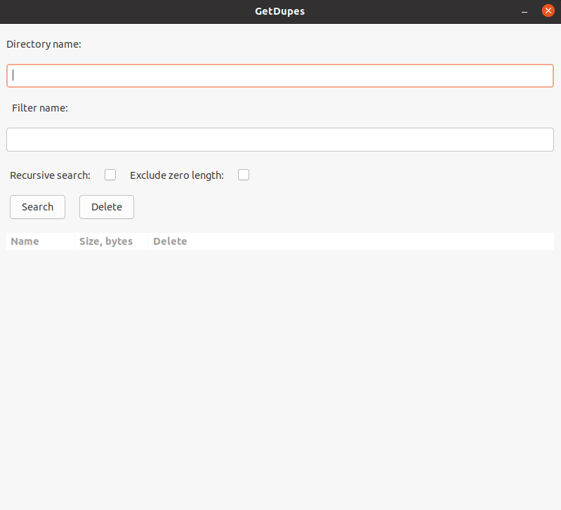

# Требования к проекту
---

# Содержание
1 [Введение](#intro)  
1.1 [Назначение](#appointment)  
1.2 [Бизнес-требования](#business_requirements)  
1.2.1 [Исходные данные](#initial_data)  
1.2.2 [Возможности бизнеса](#business_opportunities)  
1.2.3 [Границы проекта](#project_boundary)  
1.3 [Аналоги](#analogues)  
1.3.1 [fdupes](#fdupes)  
1.3.2 [FSlint](#FSlint)  
1.3.3 [dupeGuru](#dupeGuru)  
2 [Требования пользователя](#user_requirements)  
2.1 [Программные интерфейсы](#software_interfaces)  
2.2 [Интерфейс пользователя](#user_interface)  
2.3 [Характеристики пользователей](#user_specifications)  
2.3.1 [Классы пользователей](#user_classes)  
2.3.2 [Аудитория приложения](#application_audience)  
2.3.2.1 [Целевая аудитория](#target_audience)  
2.3.2.1 [Побочная аудитория](#collateral_audience)  
2.4 [Предположения и зависимости](#assumptions_and_dependencies)  
3 [Системные требования](#system_requirements)  
3.1 [Функциональные требования](#functional_requirements)  
3.1.1 [Основные функции](#main_functions)  
3.1.1.1 [Указание каталога для поиска](#catalog_name)  
3.1.1.2 [Указания имени для применения фильтра](#filter_name)  
3.1.1.3 [Выборочный рекурсивный поиск](#recursive_search)  
3.1.1.4 [Выборочное отображение файлов нулевой длины](#Exclude_zero)  
3.1.1.5 [Поиск дубликатов файлов](#Search)  
3.1.1.6 [Удаление выбранных файлов](#Delete)  
3.1.2 [Ограничения и исключения](#restrictions_and_exclusions)  
3.2 [Нефункциональные требования](#non-functional_requirements)  
3.2.1 [Атрибуты качества](#quality_attributes)  
3.2.1.1 [Требования к удобству использования](#requirements_for_ease_of_use)  
3.2.1.2 [Требования к безопасности](#security_requirements)  
3.2.2 [Внешние интерфейсы](#external_interfaces)  
3.2.3 [Ограничения](#restrictions)  

<a name="intro"/>

# 1 Введение

<a name="appointment"/>

## 1.1 Назначение
Документ разработан для однозначной трактовки требований между разработчиком и заказчиком. Необходимо разработать утилиту для поиска дубликатов файлов с низкой требовательностью к производительности ПК. В этом документе описаны функциональные и нефункциональные требования к разрабатываемому проекту для ОС Linux. Этот документ предназначен для команды, которая будет реализовывать и проверять корректность работы приложения.

<a name="business_requirements"/>

## 1.2 Бизнес-требования

<a name="initial_data"/>

### 1.2.1 Исходные данные
Наличие свободного места в памяти компьютера оказывает непосредственное влияние на его быстродействие. Наличие большого количества дубликатов файлов мешает пользователю ориентироваться в каталогах. Эти проблемы может решить удаление скопившихся временных файлов или копий созданных пользователем. Утилиты для поиска и дубликатов файлов предоставляют возможность этого.

<a name="business_opportunities"/>

### 1.2.2 Возможности бизнеса
Так как все пользователи ОС Linux используют файлы, утилита для поиска дубликатов файлов будет полезна для любого из них. Подобные программы предоставляют возможность легко и быстро найти и удалить дубликаты файлов. При разработке интерфейс должен быть спроектирован минималистично, т.к. сейчас минимализм стал одной из самых распространенных тенденций в веб-дизайне, дизайне мобильных и десктопных приложений. Простота эквивалентна удобству. Данная утилита должна являться простой в освоении и интуитивно понятной в управлении, что всегда приветствуется пользователями, а также она должна иметь низкие системные требования.

<a name="project_boundary"/>

### 1.2.3 Границы проекта
Утилита должна иметь графический интерфейс, чтобы обеспечить взаимодействие пользователя с ее возможностями, в ней должны быть реализованны базовые возможности, представленные в аналогичных программах: поиск дубликатов файлов в заданном каталоге, возможность рекурсивного поиска файлов внутри вложенных каталогов, удаление выбранных дубликатов, возможность фильтрации файлов по названию. Должен быть реализован эффективный и быстрый алгоритм поиска.

<a name="analogues"/>

## 1.3 Аналоги

<a name="fdupes"/>

### 1.3.1 «fdupes»
Команда fdupes обычно не устанавливается по умолчанию, но она доступна в репозиториях многих дистрибутивов Linux. Это простое инструментальное средство командной строки. Вероятно, это самый удобный и быстрый инструмент, который можно использовать в случае, если вы хотите найти дубликаты файлов в среде, где у вас есть доступ только к командной строке Linux, а не к графическому интерфейсу пользователя.

<a name="FSlint"/>

### 1.3.2 «FSlint»
Пакет FSlint доступен в репозиториях программ различных дистрибутивов Linux, в том числе для Ubuntu, Debian, Fedora и Red Hat. В этой программе по умолчанию предоставляется удобный графический интерфейс, но также есть различные функции этого пакета, работающие из командной строки. Как и у многих приложений Linux, графический интерфейс пакета FSlint является лишь внешним интерфейсом, который обращается к командам Fslint, лежащим глубже.
По умолчанию, графический интерфейс FSlint открывается при выборе панели Duplicates (Дубликаты) и указывается путь к вашему домашнему каталогу. Все, что вам нужно сделать, это нажать на кнопку Find (Найти) и пакет FSlint найдет список дубликатов файлов, находящихся в каталогах внутри вашего домашнего каталога. Используйте кнопки для удаления тех файлов, которые вы хотите удалить, и дважды щелкните по ним для того, их просмотреть.

<a name="dupeGuru"/>

### 1.3.3 «dupeGuru»
Программа dupeGuru ищет файлы как с одинаковыми или похожими названиями, так и с идентичным содержимым. Хорошо работает с музыкой и может отыскивать одинаковые музыкальные файлы, даже если у них разные теги. Кроме того, dupeGuru умеет сравнивать изображения, чтобы найти не только одинаковые, но и просто похожие фотографии. Разрабатывается для Mac и Linux.

<a name="user_requirements"/>

# 2 Требования пользователя

<a name="software_interfaces"/>

## 2.1 Программные интерфейсы
Продукт должен являться утилитой для OC Linux и иметь простой интерфейс пользователя. Приложение должно быть реализовано с помощью библиотеки GTK3+ и написано на языке программирования С. 

<a name="user_interface"/>

## 2.2 Интерфейс пользователя

<a name="start_window"/>

Окно утилиты  
  

<a name="user_specifications"/>  

## 2.3 Характеристики пользователей

Для данного приложения предусмотренно два вида пользователей: пользователь с правами суперпользователя, пользователь без прав суперпользователя. Наличие прав суперпользователя зависит от того, кто запускает утилиту.

<a name="user_classes"/>

### 2.3.1 Классы пользователей

| Класс пользователей | Описание |
|:---|:---|
| Обычный пользователь | Пользователи, которые могут получать доступ к ограниченному числу каталогов |
| Суперпользователь | Пользователи, которые могут получать доступ к любым каталогам |

<a name="application_audience"/>

### 2.3.2 Аудитория приложения
Люди любой возрастной категории, желающие удалить ненужные файлы.
<a name="target_audience"/>

#### 2.3.2.1 Целевая аудитория
Пользователи дистрибутивов Linux, которые создают большое количество временных системных файлов и засоряют свободное место.

<a name="collateral_audience"/>

#### 2.3.2.2 Побочная аудитория
Пользователи имеющие привычку создавать множество копий файлов.

<a name="assumptions_and_dependencies"/>

## 2.4 Предположения и зависимости
Приложение будет работать только на ОС Linux с установленной графической оболочкой.

<a name="system_requirements"/>

# 3 Системные требования

<a name="functional_requirements"/>

## 3.1 Функциональные требования

<a name="main_functions"/>

### 3.1.1 Основные функции

<a name="catalog_name"/>

#### 3.1.1.1 Указание каталога для поиска
**Описание.** Должен указываться каталог, в котором производиться поиск.  
**Требования.** Должна быть реализованна проверка на правильность указания каталога. 

<a name="filter_name"/>

#### 3.1.1.2 Указания имени для применения фильтра.
**Описание.** При желании пользователя должно указываться имя файла для фильтрации.  
**Требования.** Должна быть реализованна валидация введенного пользователем фильтра. 

<a name="recursive_search"/>

#### 3.1.1.3 Выборочный рекурсивный поиск.
**Описание.** Должен быть реализован выбор между рекурсивным и не рекурсивным поиском.  
**Требования.** При указании, что поиск проводиться рекурсивно, программа должна искать дубликаты во вложенных каталогах. 

<a name="Exclude_zero"/>

#### 3.1.1.4 Выборочное отображение файлов нулевой длины.
**Описание.** Должен быть реализован выбор между отображением и скрытием файлов нулевой длины.  
**Требования.** Если была указанна опция исключения файлов нулевой длины, они должны игнорироваться программой на стадии просматривания всех файлов в указанных каталогах.

<a name="Search"/>

#### 3.1.1.5 Поиск дубликатов файлов.
**Описание.** Должна быть кнопка, при нажатии на которую начнется поиск дубликатов в указанном каталоге.  
**Требования.** Должен быть реализован быстрый и эффективный алгоритм поиска дубликатов файлов.

<a name="Delete"/>

#### 3.1.1.6 Удаление выбранных файлов.
**Описание.** Должна быть кнопка, при нажатии на которую будут удалены указаные пользователи файлы в списке найденных дубликатов.  
**Требования.** Удаление должно работать только при условии, если пользователь нашел и указал удаляемые дубликаты файлов.

<a name="restrictions_and_exclusions"/>

### 3.1.2 Ограничения и исключения
1. Приложение выполняет весь функционал без наличия подключения к Интернету;
2. Для работы приложения в дистрибутиве Linux должна присутствовать графическая оболочка.

<a name="non-functional_requirements"/>

## 3.2 Нефункциональные требования

<a name="quality_attributes"/>

### 3.2.1 Атрибуты качества

<a name="requirements_for_ease_of_use"/>

#### 3.2.1.1 Требования к удобству использования
1. Понятность в управлении приложением используя клавиатуру;
2. Интуитивно понятный интерфейс.
3. Быстрый отклик приложения.

<a name="security_requirements"/>

#### 3.2.1.2 Требования к безопасности
Данное приложение является полностью безопасным, т.к. оно не собирает какую-либо информацию о пользователе и не имеет доступа в Интернет.

<a name="external_interfaces"/>

### 3.2.2 Внешние интерфейсы
Окна приложения удобны для использования пользователями с плохим зрением:
  * Крупный размер шрифта (не менее 12пт);
  * Приятное сочетание цветов.

<a name="restrictions"/>

### 3.2.3 Ограничения
1. Приложение должно быть реализовано на языке C;
2. Приложение должно использовать библиотеку GTK+ 3, для обеспечения графческого интерфейса;
3. Приложение должно стабильно работать на дистрибутивах Debian, Fedora, Arch.
